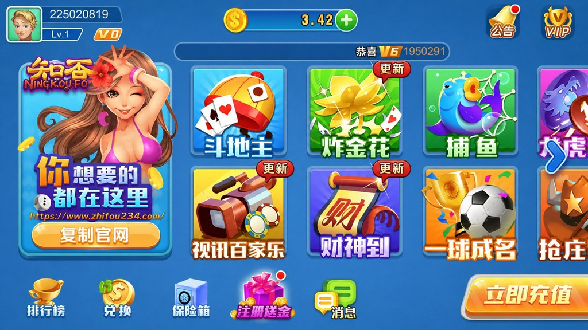
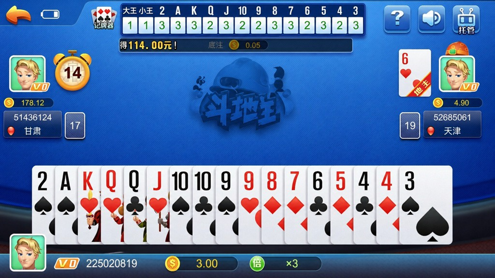
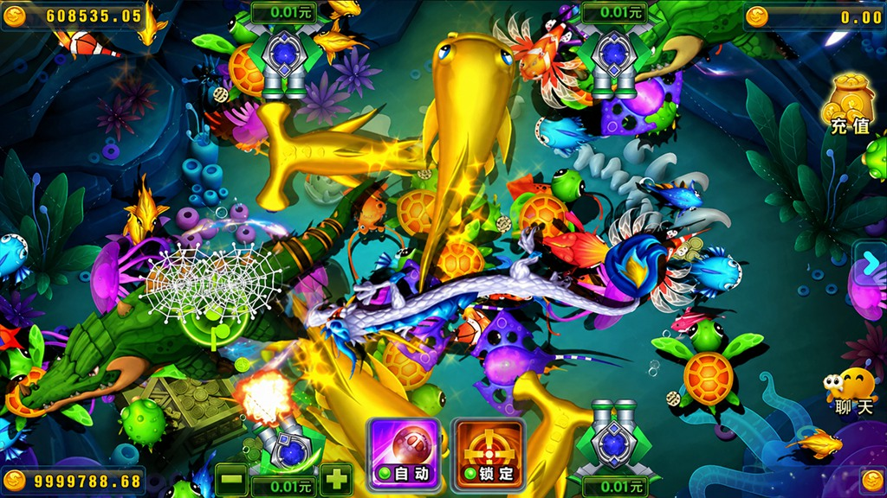
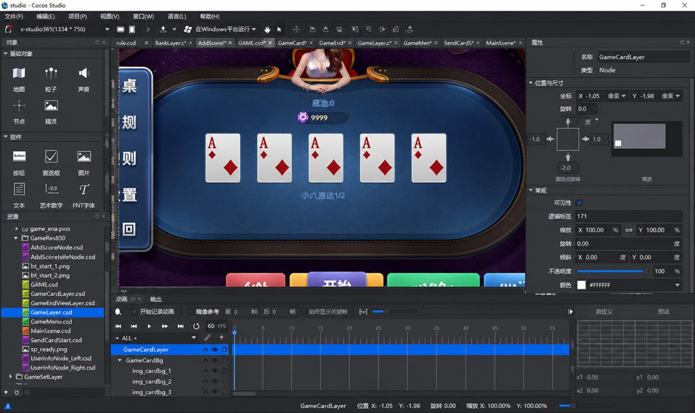
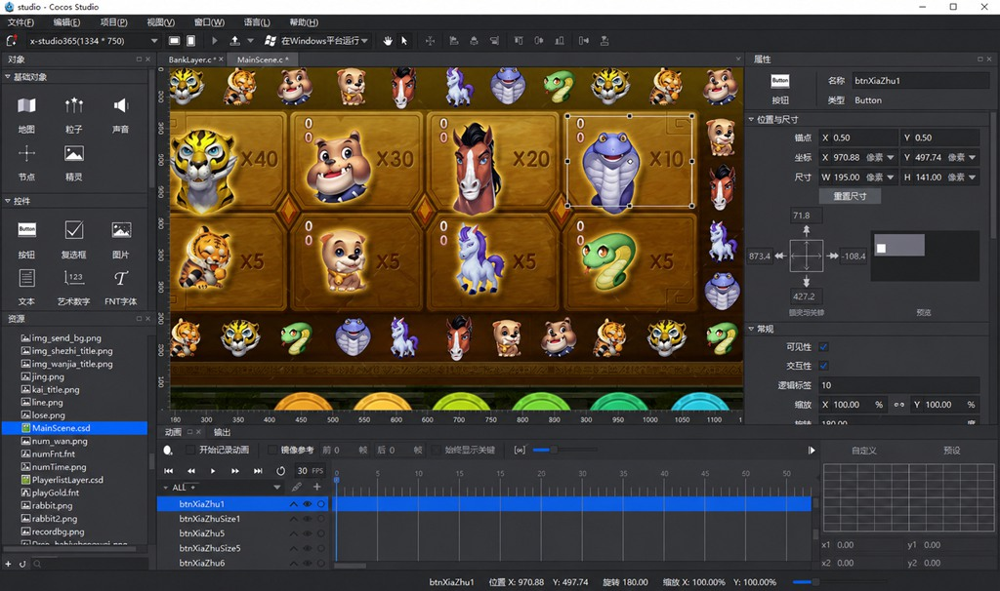
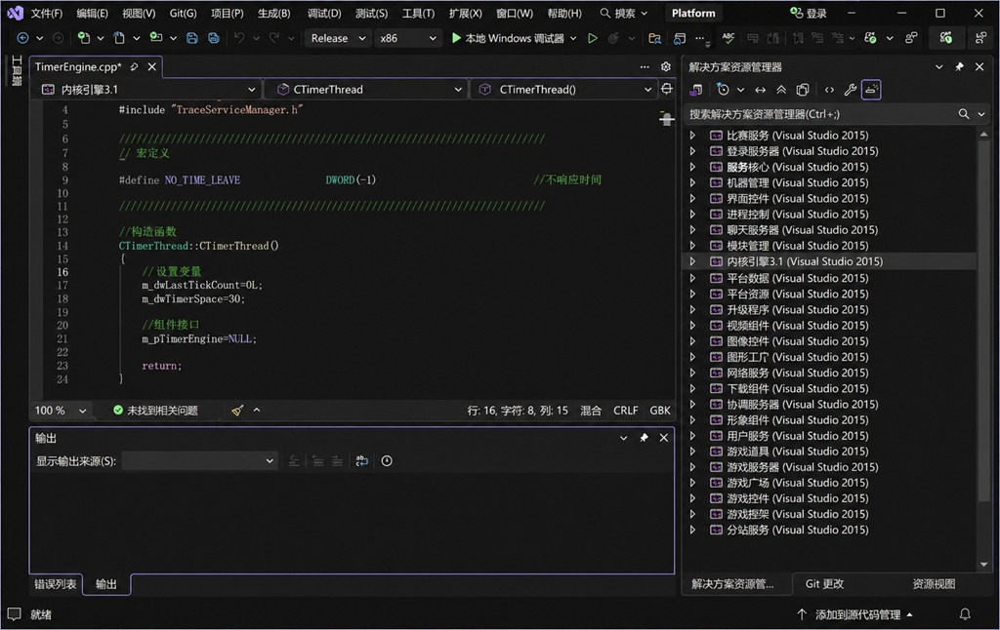
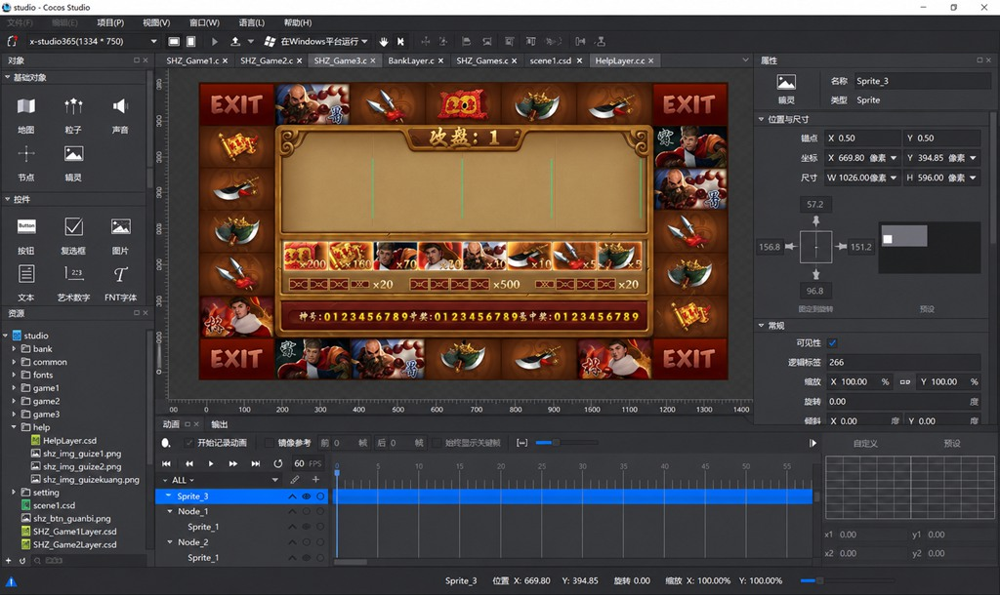
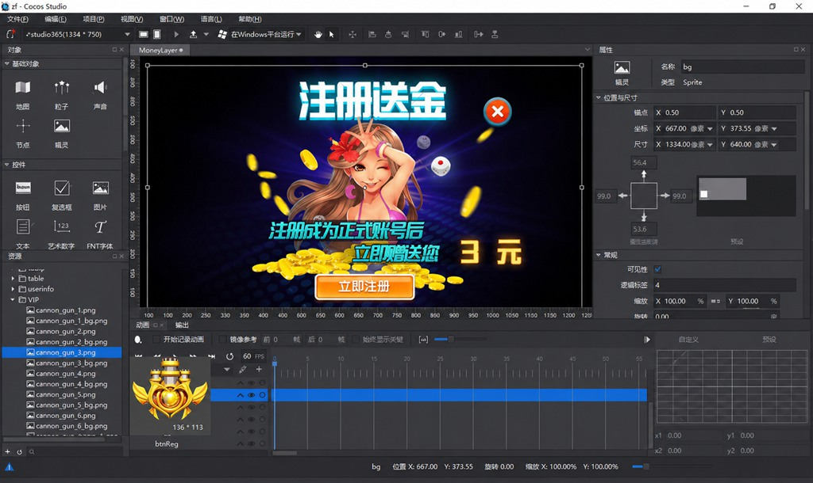

# 新火萤 · 棋牌游戏源码

**把大厅、游戏、服务端和界面工程放在一起，为你的游戏大业二次开发提供项目基础。**

客户端 · C++ 服务端 · Web 前后台 · 数据库 · Cocos Studio 界面工程

**完整源码：500 美元（USD 500）｜包含所有前后端原始代码**

[查看产品画面](#产品画面) · [了解源码组成](#源码里有什么) · [咨询演示与购买](#咨询与购买)


> 完整源码售价为 500 美元（USD 500），包含所有前后端原始代码：游戏客户端、服务端、Web 前台及管理后台。本项目为付费源码，具体交付版本、配套资源、使用授权与服务内容在购买前确认。

## 先看演示，再确定你需要的版本

如果你正在寻找可供评估、改造和二次开发的棋牌游戏项目，可以先从大厅与游戏画面了解产品，再按目标玩法、运行平台和开发需求确认版本与交付安排。

**咨询需求 → 查看对应版本演示 → 确认源码与资源清单 → 确认购买及授权 → 交付验收。**

[前往咨询与购买](#咨询与购买)

## 源码里有什么

项目覆盖从客户端界面到服务端工程、Web 前后台和数据库文件的多个部分，方便开发团队按模块评估与接手。

| 组成 | 当前项目内容 | 二次开发关注点 |
| --- | --- | --- |
| 游戏客户端 | Cocos2d-x / Lua 工程 | 大厅界面、游戏入口、客户端交互 |
| 服务端 | C++ / Visual Studio 工程，包含平台组件和子游戏目录 | 服务逻辑、协议对接、游戏模块 |
| Web 前后台 | C# / .NET Framework，包含 RYFront 与 RYAdmin | 网站与管理端功能调整 |
| 数据库 | 账号、平台、记录等数据库相关文件 | 数据结构、版本匹配、初始化与恢复 |
| 界面工程 | UI、UI_Game 与 Cocos Studio 工程 | 界面布局、主题和资源调整 |
| 配套内容 | 工具及运行相关目录 | 按交付版本核对用途与依赖 |

### 游戏模块

以下是源码目录中可识别的代表性模块。

| 类别 | 代表性模块 |
| --- | --- |
| 棋牌 | 斗地主、跑得快、湖南跑得快、十三水、510K、德州扑克、牛牛 |
| 麻将 | 二人麻将、二人红中麻将、血战麻将 |
| 捕鱼 | 捕鱼、千炮捕鱼、鳄鱼捕鱼、新金蝉捕鱼、新李逵劈鱼 |
| 其他场景 | 财神到、水浒传、飞禽走兽等 |

## 产品画面


### 斗地主



### 捕鱼



### 可视化界面工程

界面工程截图展示了 Cocos Studio 中的节点、资源和布局编辑场景，便于评估界面改造工作。

| 牌桌界面编辑 | 场景界面编辑 |
| --- | --- |
|  |  |
### 更多工程与界面图片

#### 服务端开发工程



#### 水浒传界面工程



#### 活动界面与编辑工程



## 从评估到交付

1. **明确需求。** 说明目标游戏、运行平台，以及计划调整的界面或业务功能。
2. **核对演示。** 确认所看版本与拟购买的源码版本一致。
3. **确认清单。** 列明客户端、服务端、Web、数据库、界面工程和资源的交付范围。
4. **确认授权与服务。** 确认费用、使用范围，以及是否包含部署、定制、维护和升级。

## 开发环境与项目结构

客户端包含 Cocos2d-x / Lua 工程；服务端使用 C++ / Visual Studio；Web 使用 .NET Framework，不同子项目可见 4.5、4.5.1、4.8 等目标版本。

```text
HY/
├── client/       # 客户端与引擎相关工程
├── Server/       # 平台服务、公共组件与子游戏
├── WebCode/      # Web 前台与管理后台
├── DB/           # 数据库相关文件
├── UI/           # 界面工程与资源
├── UI_Game/      # 游戏界面工程与资源
├── tool/         # 配套工具
├── 运行/         # 运行相关文件
```

## 购买前常见问题

**这是免费或开源项目吗？**  
不是，收费的，价格500 美元。

**可以二次开发吗？**  
可以的，源码包含原始代码，无加密授权。

**购买后可以直接运行吗？**  
需要匹配对应版本的编译环境、数据库和配置。建议在 Windows 服务器上进行测试编译, 8H16G 100G 硬盘

**价格多少？包括维护吗？**  
完整源码价格为 **500 美元（USD 500）**，包含**所有前后端原始代码**，包括游戏客户端、服务端、Web 前台及管理后台。部署、定制、维护及升级不包含。

## 咨询与购买

**售价：500 美元（USD 500）。包含所有前后端原始代码。**

**Telegram：** [@usdtvps666](https://t.me/usdtvps666)

**WhatsApp：** [+44 7936 866117](https://wa.me/447936866117)

咨询时可直接发送：

> 我想了解新火萤源码，关注的游戏是：____；目标平台是：____；是否需要部署协助：____；计划二次开发的内容：____。我已了解完整源码售价为 500 美元，请提供对应版本演示、交付清单和购买方式。

## 商业授权说明

本项目按源码完整包付费交付。源码、配套资源的使用范围，以及修改、转售、再分发等权限，以双方明确约定为准；第三方组件与素材遵循各自的许可要求。
